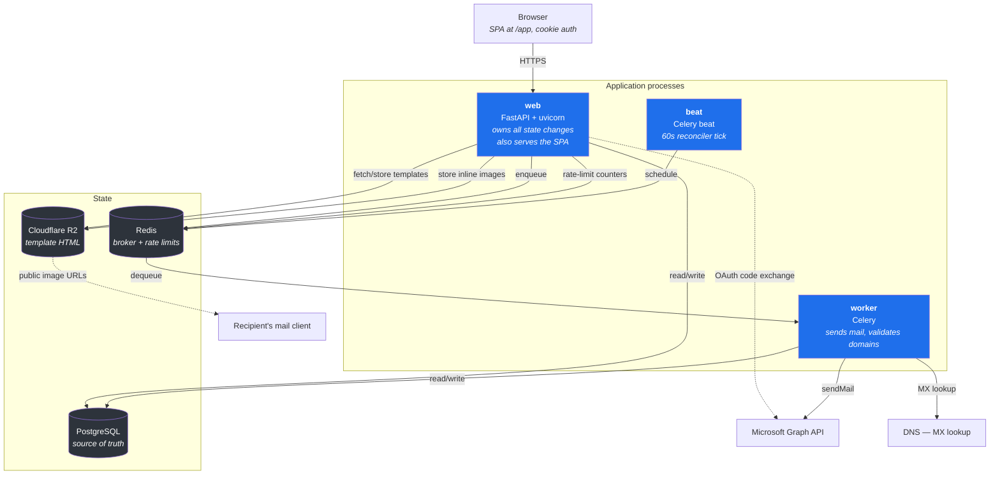
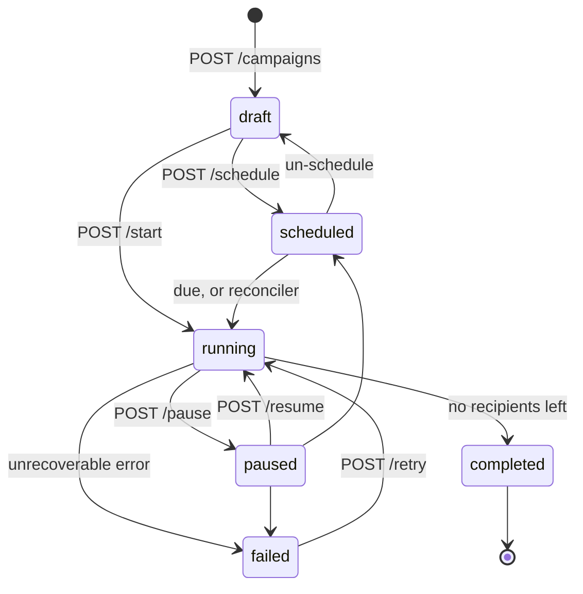
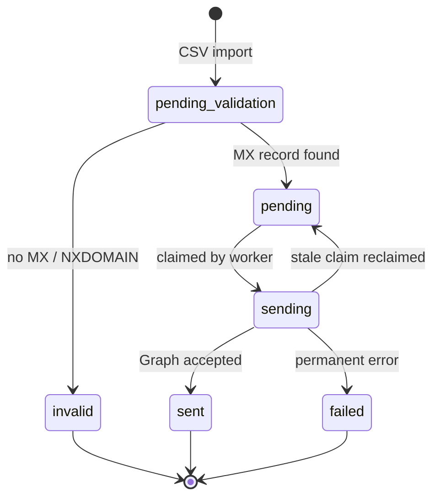
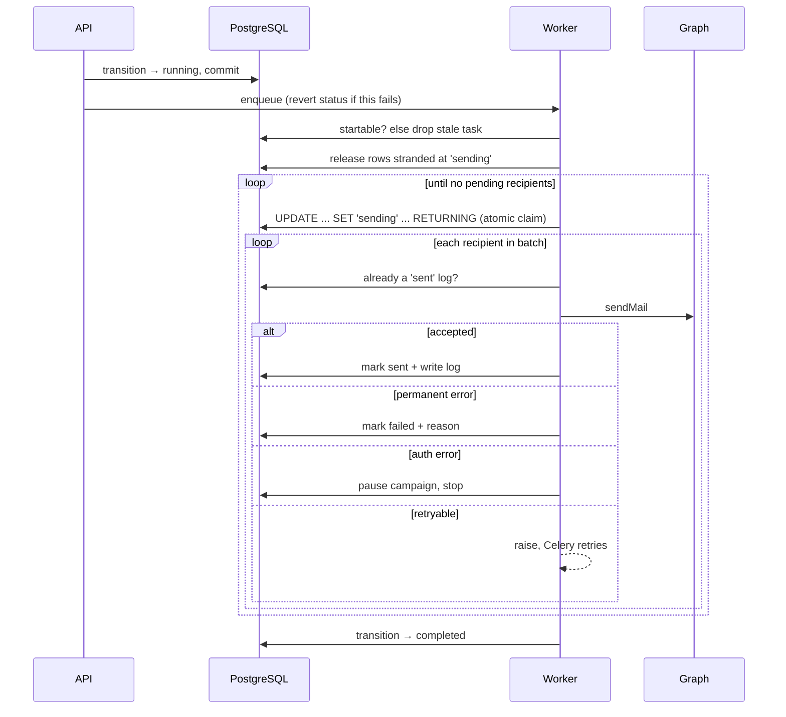
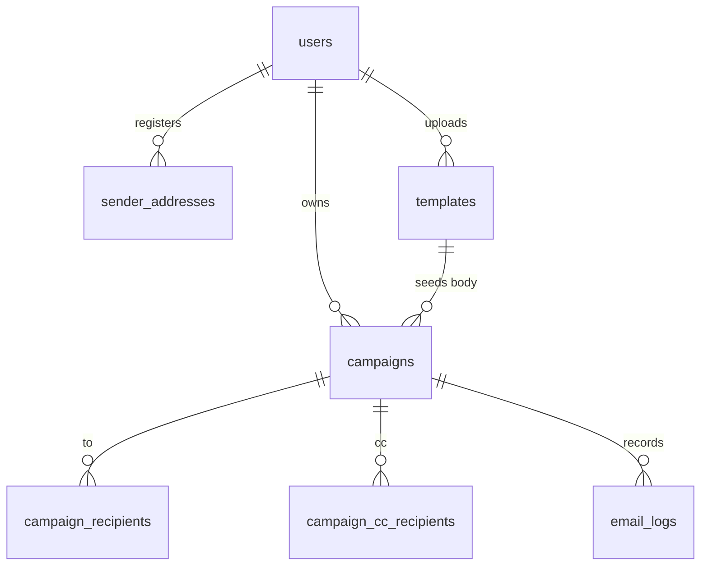

# Architecture

The blueprint for Full Stack Mailer: what the system is made of, how a campaign moves through
it, and why the load-bearing decisions were made the way they were.

- Local setup → [../README.md](../README.md)
- Deployment → [deploy.md](deploy.md)

---

## 1. What it does

Users connect a Microsoft work account over OAuth. The service stores their Graph tokens
encrypted, imports recipient lists from CSV, validates the addresses, and sends campaigns
through the Microsoft Graph API — from the user's own mailbox or a shared mailbox they hold
rights to.

A React single-page app in `backend/frontend/` is served by the web process itself, under `/app`. It
covers everything the API exposes, and is built around a campaign body editor with two authoring
modes — see decision 15.

## 2. System diagram



**The web process owns every state change.** Workers execute; they never decide whether a
campaign may run. That decision is made once, in the API, against the state machine.

## 3. Campaign lifecycle



`completed` is terminal — there is no route out of it. That single fact drives several
decisions below: anything that lets a campaign reach `completed` prematurely is unrecoverable
data loss from the operator's point of view.

Transitions live in exactly one place, `app/services/campaign_state.py`. Nothing else assigns
to `campaign.status` except the two recovery paths that deliberately revert one
(`_transition_and_dispatch` on broker failure, `_mark_failed` on unrecoverable error).

## 4. Recipient lifecycle



The send worker selects only `status = 'pending' AND dns_valid IS TRUE`. Every other state is
invisible to it, which is why `pending_validation` rows silently produce a campaign that sends
to nobody — see decision 3.

## 5. Send path



---

## Design decisions

Each entry states the decision, the failure it prevents, and where it lives.

### 1. The batch claim is a single atomic UPDATE

`app/workers/send_campaign.py::_get_pending_recipients`

Claiming a batch flips `status` to `'sending'` **inside the same statement** that selects it:

```sql
UPDATE campaign_recipients SET status = 'sending'
WHERE id IN (SELECT ... WHERE status = 'pending' LIMIT 10 FOR UPDATE SKIP LOCKED)
RETURNING *
```

The obvious implementation — `SELECT ... FOR UPDATE SKIP LOCKED`, then write each row as it is
sent — is wrong. Those row locks last only as long as the transaction, and the send loop
commits after *every* recipient. The first commit releases the locks on the nine recipients not
yet sent, and a second worker can claim and send them. Duplicate delivery is the worst failure
this product has.

Backed by a partial unique index on `email_logs (campaign_id, recipient_email) WHERE status =
'sent'`, so a duplicate becomes a database error rather than a second email. The index is
partial because `failed` rows repeat legitimately across retries.

### 2. Resume goes straight to `running`, clearing the schedule

`app/api/campaigns.py::resume_campaign`

Resuming into `scheduled` while leaving a past `scheduled_at` in place meant the beat
reconciler matched the campaign on its next tick and dispatched a *second* task alongside the
one resume had just queued — creating exactly the two-workers-on-one-campaign condition that
decision 1 defends against.

### 3. `/start` and `/schedule` refuse a campaign that cannot send

`app/api/campaigns.py::_assert_sendable`

Because the worker only sees `pending` + `dns_valid`, a campaign whose recipients are still at
`pending_validation` finds nothing to do, exits its loop, and transitions itself to
`completed` — terminal — having sent nothing, while the API reports success. The precondition
check is in the API because that is the last point at which a human can be told.

### 4. State is committed before dispatch, and reverted if dispatch fails

`app/api/campaigns.py::_transition_and_dispatch`

`running` has no transition back to `draft` or `scheduled`. A campaign committed as `running`
with no task behind it is stuck short of an operator pausing and resuming it. So a failed
`.delay()` reverts the status and returns `503`.

### 5. The reconciler makes the database the source of truth

`app/workers/reconcile_campaigns.py`

`apply_async(eta=...)` parks a task inside Redis. A flush, purge, or broker restart loses it
silently, and the campaign sits past its scheduled time with nothing to run it. The beat tick
re-queues anything overdue, and separately sweeps recipients stranded at `pending_validation`
by an enqueue that never landed.

**Run exactly one beat process.** Two means duplicate ticks.

### 6. Stale `sending` rows are reclaimed at task start

`app/workers/send_campaign.py::_release_stale_sending`

A worker killed mid-send leaves rows at `sending`, which match neither the pending filter nor
`sent` — they would be skipped forever. Reclaimed after 30 minutes, long enough not to race a
live worker on a slow Graph call.

### 7. OAuth state is bound to the browser with a cookie

`app/api/auth.py`

A signed `state` proves only that *this server* minted it — not that it minted it for *this
browser*. Without binding, an attacker mints their own state, pairs it with their own
authorization code, and walks a victim through a callback that logs the victim into the
attacker's account. `/login` sets the raw state in a short-lived `HttpOnly` cookie scoped to
`/auth`; the callback requires a `compare_digest` match.

### 8. Error responses from third parties are never logged verbatim

`app/api/auth.py`, `app/services/email_sender.py`, `app/services/microsoft_token_service.py`

An OAuth error echoes submitted parameters including the authorization code. A Graph send
error echoes the submitted message — campaign HTML and the recipient address. Only status
codes and machine-readable error codes are logged. For the same reason, recipient and user
addresses are logged by id, not by address; `email_logs` is the deliberate audit record.

### 9. Rate limits are shared, and degrade rather than fail

`app/core/rate_limit.py`

Counters live in Redis, because in-process counters are per-worker and reset on restart. But
an unreachable Redis makes slowapi raise inside the middleware, turning *every* request into a
500 — so an in-memory fallback is enabled. Losing shared counters during an outage beats losing
the API.

`get_remote_address` reads the socket peer, which behind a load balancer is the proxy. uvicorn
must run with `--proxy-headers` or every caller shares one bucket.

### 10. Redis TLS verifies certificates

`app/core/config.py`, `app/workers/celery.py`

redis-py 7.x already defaults to `cert_reqs='required'` with hostname checking; the previous
explicit `CERT_NONE` was an active downgrade of a safe default. Options are sent only for
`rediss://` URLs, because passing them on a plain `redis://` connection is silently ignored and
hides whether verification is in force.

`REDIS_SSL_CERT_REQS` exists as an escape hatch for a private CA. `ssl_check_hostname` travels
with it, because Python refuses to combine hostname checking with `CERT_NONE`.

### 11. Uploads are capped while streaming

`app/api/campaigns.py::_stream_to_disk`

`UploadFile` does not know the length up front and `Content-Length` is caller-controlled, so
the cap is enforced byte-by-byte as the file is written. Staging uses a per-request
`tempfile.TemporaryDirectory` — nothing is written until a request arrives, and nothing
survives a crash.

### 12. Ids are `uuid.UUID`, not `str`

`app/models/base.py`

The column is `UUID(as_uuid=True)`, so every read returns a real `UUID`. Annotating it `str`
made ids look like strings to the type checker while behaving as UUIDs at runtime — the
mismatch that defensive `str(...)` calls were papering over.

### 13. Templates are shared across all users

`app/api/templates.py` — **accepted risk, deliberate**

Every authenticated user can list and use every template; only the uploader can delete one.
This is the single resource in the system that is not tenant-scoped. Revisit if the product
gains untrusted or multi-customer tenants.

### 14. Send throughput is capped, knowingly

`app/workers/send_campaign.py` — **accepted risk, deliberate**

The worker sleeps 5 seconds between sends inside the task, so one campaign occupies one worker
slot for its whole duration — at `--concurrency=4`, four concurrent campaigns. Adequate at
current volume. The fix, when it stops being adequate, is to chain per-batch tasks with
`countdown=` rather than blocking.

### 15. The editor's two modes are exclusive, not two views

`backend/frontend/src/components/editor/` — the load-bearing frontend decision

Email HTML and rich-text HTML are different languages. A WYSIWYG parses pasted markup into its own
schema and re-serialises it; a table-based template built for Outlook goes in and comes out
restructured. So a campaign is authored in one mode or the other, not both:

- A body that is a **full HTML document** — `<html>`, `<body>`, or a top-level `<table>` — belongs
  to the source editor and is stored byte for byte. Compose is locked for that campaign, and the
  UI says why.
- A **composed** body is wrapped at save time in a minimal email shell: a centred single-column
  table with inline styles, because TipTap emits `<p>` and `<h1>`, which mail clients disagree
  about. The shell is recognisable on reopen, so a composed campaign returns to compose.

Compose → source is offered once, with a warning. Source → compose is offered only while the
source is still a fragment.

### 16. Inline images are uploaded, never embedded

`backend/app/api/assets.py`, `backend/frontend/src/components/editor/ImageUpload.ts`

Word and Google Docs carry pasted images as `data:` URIs. Left alone they would be inlined into
every message — and Gmail clips a message over 102 KB, so a single base64 image can truncate the
email. Every image, however it arrives (clipboard file, `data:` URI in pasted HTML, drag-and-drop,
toolbar), is uploaded to R2 first and referenced by public URL.

That URL has to be **publicly readable**: it is fetched by the recipient's mail client, which has
no session and cannot sign a request. Hence `R2_PUBLIC_BASE_URL`, and hence `POST /assets`
returning `503` when it is unset rather than emitting links that resolve to nothing.

Uploads identify the format from the file's **magic bytes**, not its `Content-Type` or extension —
both are caller-supplied. Asset objects are never deleted: an email that has already been
delivered keeps pointing at its images.

### 17. The body is not sanitised; the preview is isolated

`backend/frontend/src/components/editor/PreviewPane.tsx`

Sanitising email HTML hard enough to be safe also strips the tables and inline styles that make it
render in Outlook — so `template_body` is stored exactly as written. The preview renders it in an
iframe with `sandbox=""`: no `allow-scripts`, no `allow-same-origin`. That boundary costs nothing
and loses nothing, which server-side sanitising cannot claim.

### 18. The SPA lives under `/app`, and the API keeps the root

`backend/app/spa.py`

Same-origin, so the session cookie stays `SameSite=lax` and production needs no CORS at all. But
the API already owns the root namespace: `/campaigns` is the campaign list *endpoint*, so the
campaign list *page* cannot also be `/campaigns`. Rather than moving every documented API path
under `/api` — which would mean re-registering the OAuth redirect URI in Azure — the SPA takes one
prefix of its own.

The catch-all serves the shell for `/app/*` only and 404s everything else. An allowlist, because a
mistyped endpoint has to fail as a missing endpoint: answering `200` with HTML would make a client
try to parse the page shell as JSON.

---

## Data model



Every child of `campaigns` cascades on delete, at the database level rather than only in the
ORM. Tenant scoping is enforced by `user_id` filters in the API and asserted in
`tests/test_isolation.py` — templates excepted, per decision 13.

Migrations are a single linear chain; there are no branched heads. Constraint names come from
`app/db/base.py`'s naming convention, so autogenerated downgrades are runnable.

## Conventions

- **Business logic lives in `app/services/`**, not in route handlers. Handlers validate, call a
  service, and shape the response.
- **`app/workers/` never decides policy.** It reads state and acts; the API decides.
- **mypy runs strict.** `pyproject.toml` documents the two deliberate relaxations.
- **Comments explain why, not what.** Anything needing a paragraph belongs in this file.
